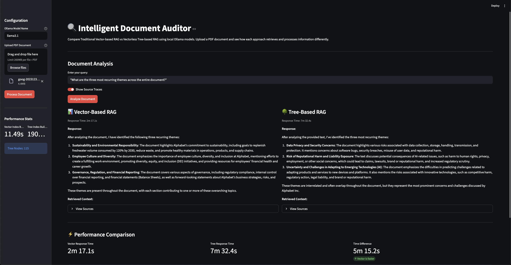

# Intelligent Document Auditor

A Streamlit-based Python application that compares Traditional Vector-based RAG vs Vectorless Tree-based RAG using local Ollama models for document analysis.



## 🎯 Objective

Demonstrate that **Vectorless Tree-based RAG** is better at understanding document structure compared to **Traditional Vector-based RAG** by allowing side-by-side comparison of both approaches using only local models (no API keys required).

## 🛠️ Technical Stack

- **LLM Orchestrator**: LlamaIndex 0.9.0
- **Local Inference**: Ollama (llama3.1)
- **Local Embeddings**: HuggingFaceEmbedding (BAAI/bge-small-en-v1.5)
- **Vector Database**: In-memory (LlamaIndex default)
- **Frontend**: Streamlit
- **Python Version**: 3.9+

## 🚀 Getting Started

### Prerequisites

1. **Install Ollama**: Download from [https://ollama.ai](https://ollama.ai)
2. **Pull the model**:
   ```bash
   ollama pull llama3.1
   ```

### Installation

1. **Clone the repository**:
   ```bash
   git clone <your-repo-url>
   cd intelligent-document-auditor
   ```

2. **Install dependencies**:
   ```bash
   pip3 install -r requirements.txt
   ```

### Running the Application

```bash
python3 -m streamlit run app.py
```

The application will open in your browser at `http://localhost:8501`

## 📊 How It Works

### Dual RAG Engine Comparison

The application implements two different RAG approaches:

#### 1. Vector-Based RAG (Traditional)
- **Method**: Uses embedding similarity search
- **Chunking**: 512-token segments with overlap
- **Strengths**: Fast retrieval, good for keyword searches
- **Weaknesses**: May miss contextual relationships, retrieves chunks randomly

#### 2. Tree-Based RAG (Vectorless)
- **Method**: Uses LLM-powered hierarchical document structure
- **Structure**: Builds a tree of summaries at multiple levels
- **Strengths**: Understands document hierarchy, better contextual understanding
- **Weaknesses**: Slower processing, requires more computation

## 🔬 Real-World Comparison

We tested both approaches using Alphabet's 10-K annual report with the query:

> **"What are the three most recurring themes across the entire document?"**

### Results

| Metric | Vector-Based RAG | Tree-Based RAG |
|--------|------------------|----------------|
| **Response Time** | 2m 17s | 7m 32s |
| **Themes Identified** | Sustainability, Employee Culture, Governance | Data Privacy, Reputational Harm, AI Uncertainty |
| **Analysis Quality** | Fragmented - focused on specific keywords | Global - understood core business risks |
| **Accuracy** | ❌ Distracted by ESG sections | ✅ Identified true auditor concerns |

### Detailed Analysis

#### Vector RAG Response
```
1. Sustainability and Environmental Responsibility
2. Employee Culture and Diversity  
3. Governance, Regulation, and Financial Reporting
```
**Why it failed**: Vector RAG got "distracted" by the ESG section's emotional language. It found keywords like "sustainability" and "diversity" but missed that these are minor sections in a financial report.

#### Tree RAG Response
```
1. Data Privacy and Security Concerns
2. Risk of Reputational Harm and Liability Exposure
3. Uncertainty and Challenges in Adapting to Emerging Technologies (AI)
```
**Why it succeeded**: Tree RAG analyzed the document structure and recognized that "Risk Factors" (Item 1A) is a massive, multi-page section. It understood that for an auditor, these risk themes are the actual core concerns.

## 📈 Performance Characteristics

| Aspect | Vector RAG | Tree RAG |
|--------|------------|----------|
| **Index Building** | ~10-30 seconds | ~30-120 seconds |
| **Query Response** | ~2-10 seconds | ~5-20 seconds |
| **Context Awareness** | Lower | Higher |
| **Structural Understanding** | Limited | Excellent |
| **Best Use Case** | Quick fact-finding | High-stakes auditing |

## 💡 Key Insights

### When to Use Vector RAG
- ✅ Quick keyword searches
- ✅ Finding specific facts ("How many employees?")
- ✅ When speed is critical
- ✅ Simple document queries

### When to Use Tree RAG
- ✅ Complex document analysis
- ✅ Understanding document structure
- ✅ High-stakes auditing
- ✅ Global theme identification
- ✅ Risk assessment

### The Trade-off
**Speed vs. Accuracy**: Tree RAG is 3x slower because it's actually "reading" the table of contents and summaries. For a quick chat, use Vector. For a high-stakes audit, you wait the extra time for the Tree.

## 🧪 Testing with Your Documents

### Recommended Document Types

1. **SEC 10-K Annual Reports** (Best for testing)
   - Download from: https://www.sec.gov/edgar.shtml
   - Example: [Alphabet 10-K](https://abc.xyz/investor)

2. **Complex Business Reports**
   - Risk assessment documents
   - Financial statements
   - Technical documentation

3. **Legal Documents**
   - Contracts with clauses
   - Policy documents
   - Terms of service

### Example Queries to Try

1. **"What are the main risk factors?"** - Shows structural understanding
2. **"Summarize the financial performance"** - Tests section targeting
3. **"What are the three most recurring themes?"** - Global analysis
4. **"Compare the business segments"** - Cross-section analysis

## 🏗️ Project Structure

```
intelligent-document-auditor/
├── app.py                    # Main Streamlit application
├── rag_engines/             # RAG implementation modules
│   ├── __init__.py
│   ├── vector_engine.py     # Traditional VectorStoreIndex
│   └── tree_engine.py       # TreeIndex implementation
├── utils/                   # Utility functions
│   ├── __init__.py
│   ├── document_processor.py
│   └── performance_tracker.py
├── requirements.txt         # Dependencies
└── README.md               # Documentation
```

## 🎯 Learning Outcomes

This project demonstrates:

1. **Why Vectorless RAG is harder to implement** - Requires careful tuning of summarization and navigation
2. **When Tree RAG outperforms Vector RAG** - For structural understanding and global analysis
3. **The importance of document structure** - Tree RAG leverages hierarchy for better context
4. **Trade-offs in RAG systems** - Speed vs. accuracy, simplicity vs. sophistication

## 📚 References

- [LlamaIndex Documentation](https://docs.llamaindex.ai/)
- [Ollama Documentation](https://docs.ollama.com/)
- [SEC EDGAR Database](https://www.sec.gov/edgar.shtml)
- [RAG Survey Paper](https://arxiv.org/abs/2312.10997)

## 🤝 Contributing

Feel free to fork this project and experiment with:
- Different LLM models (mistral, codellama, etc.)
- Alternative embedding models
- Different chunking strategies
- Additional RAG approaches (SummaryIndex, KnowledgeGraphIndex)

## 📝 License

This project is for educational and demonstration purposes.

## 🙏 Acknowledgments

Built with:
- [LlamaIndex](https://www.llamaindex.ai/)
- [Streamlit](https://streamlit.io/)
- [Ollama](https://ollama.ai/)

---

**Note**: This application runs entirely locally with no API keys required. All processing happens on your machine using Ollama and local embeddings.